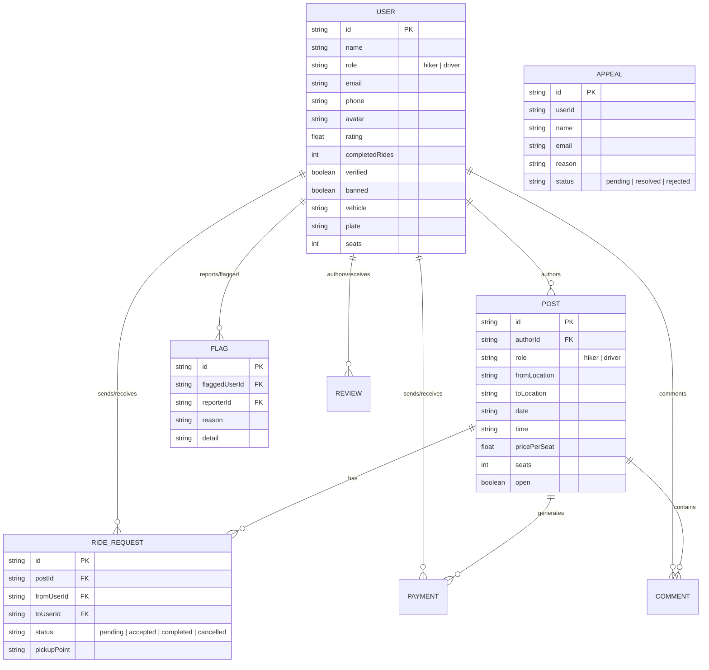

# Limpopo Hitch Connect: Architectural Blueprint & Build Plan

**Limpopo Hitch Connect** is a specialized real-time ridesharing and hitchhiking platform designed for commuter routes across Limpopo Province, South Africa (connecting hubs such as Polokwane, Tzaneen, Mokopane, Giyani, Musina, Thohoyandou, Pretoria, and Johannesburg).

---

## 1. System Purpose & Core Capabilities

### Primary Objectives
- **Safe Hitchhiking & Ridesharing:** Bridges the gap between drivers with empty seats and hikers seeking travel across Limpopo routes.
- **Dual Role Workflow:** Allows users to operate as either a **Hiker** (requesting a ride) or a **Driver** (offering seats).
- **Real-Time Trip Tracking & Telemetry:** Uses GPS Geolocation and Socket.io web sockets to stream live positions and proximity updates (e.g. within 800m dropoff threshold).
- **Community Safety & Redlisting:** Flagging mechanism for unsafe behavior, community redlist visibility, user appeals process, and administrator moderation.
- **DAC Governance:** Built-in administrative dashboard for user ban management, review moderation, flag removal, and platform health analytics.

---

## 2. System Architecture & Tech Stack

```
 ┌─────────────────────────────────────────────────────────────────────────────┐
 │                         FRONTEND (limpopo-hitch-main)                        │
 │  React 19 | TypeScript | TanStack Start & Router | Tailwind CSS v4 | Zustand │
 │  MapTiler SDK (GIS Maps) | Socket.io Client | Lucide Icons | Radix UI       │
 └──────────────────────┬──────────────────────────────┬───────────────────────┘
                        │ HTTP / REST APIs             │ WebSocket Events
                        ▼                              ▼
 ┌─────────────────────────────────────────────────────────────────────────────┐
 │                       BACKEND (limpopo-hitch-backend)                        │
 │  Node.js | TypeScript | Express.js | Socket.io Server | Helmet | CORS        │
 └──────────────────────┬──────────────────────────────┬───────────────────────┘
                        │ Prisma ORM                   │ SQLite
                        ▼                              ▼
 ┌─────────────────────────────────────────────────────────────────────────────┐
 │                         DATABASE (dev.db / SQLite)                          │
 │  Users | Posts | RideRequests | Flags | Payments | Reviews | Appeals        │
 └─────────────────────────────────────────────────────────────────────────────┘
```

### Technology Breakdown

| Component | Stack / Technologies Used | Role |
| :--- | :--- | :--- |
| **Frontend Core** | React 19, TypeScript, TanStack Start, TanStack Router | File-based routing (`src/routes`), SSR/hydration ready shell. |
| **Frontend UI/UX** | Tailwind CSS v4, Lucide Icons, Radix UI Primitives, Sonner | Modern dark/light responsive interface, status chips, micro-animations. |
| **GIS & Tracking** | MapTiler SDK, Web Geolocation API, Socket.io Client | Map rendering, route plotting, live driver/hiker GPS streaming. |
| **Frontend State** | Zustand (`mock-store.ts`), React Query (`api-hooks.ts`), Axios | Dual-layer persistence: live REST backend syncing with offline mock-store fallback. |
| **Backend Core** | Node.js, Express.js, TypeScript, Docker | RESTful API server, security headers (Helmet), CORS management. |
| **Real-time Server** | Socket.io | Room-based telemetry streaming (`trip_{id}` rooms for location updates). |
| **Database & ORM** | Prisma ORM, SQLite | Structured data access, database seeding, schema management. |
| **Security & Auth** | JWT (`jsonwebtoken`), Bcrypt.js, RBAC Middleware | Bearer token authorization, password hashing, Hiker/Driver/Admin roles. |

---

## 3. Database Schema & Data Models

The SQLite database managed by Prisma contains 8 relational models:



---

## 4. Feature Workflows & Route Structure

### Frontend Application Routes (`limpopo-hitch-main/src/routes`)

1. **`/` (`index.tsx`):** Landing page introducing the platform, mission, safety highlights, and route search entry points.
2. **`/auth` (`auth.tsx`):** Authentication hub supporting Sign In, Registration, Role selection, Verification PINs, and Google SSO linking.
3. **`/_authenticated` (`_authenticated.tsx` layout):** Protected app shell enforcing token presence and rendering navigation headers.
   - **`/_authenticated/feed`:** Dynamic ride feed displaying route posts, origin/destination search filters, price tags, and quick-request actions.
   - **`/_authenticated/post`:** Interactive multi-step form to create a driver offer (vehicle details, seats, cost) or hiker request.
   - **`/_authenticated/requests`:** Dashboard for managing sent and received ride requests (Accept/Decline/Cancel).
   - **`/_authenticated/trip/$id`:** Live trip console with MapTiler navigation maps, GPS proximity calculation, drop-off verification, and review modal.
   - **`/_authenticated/profile`:** User profile settings, vehicle details, driver ratings, and ride history.
   - **`/_authenticated/payments`:** Transaction history log and payment status updates.
   - **`/_authenticated/redlist`:** Community safety board listing flagged drivers/hikers and safety notices.
4. **`/onboarding.driver` & `/onboarding.hiker`:** Step-by-step role setup for vehicles, licenses, or travel preferences.
5. **`/appeal` (`appeal.tsx`):** Self-service appeal portal for users to dispute flags or account suspensions.
6. **`/dac-admin` (`dac-admin.tsx`):** High-privilege administrative dashboard for platform metrics, user moderation, unbanning, and review removal.

---

## 5. Step-by-Step Reconstruction & Build Plan

To build or recreate this project from scratch, follow this phased construction plan:

### Phase 1: Backend Foundation & Prisma Data Modeling
1. **Initialize Node/TS Project:** Setup `package.json`, TypeScript config (`tsconfig.json`), and Express server boilerplate.
2. **Setup Prisma ORM:** Configure SQLite database provider in `prisma/schema.prisma` and define models (`User`, `Post`, `RideRequest`, `Flag`, `Payment`, `Review`, `Appeal`, `Comment`).
3. **Execute Migrations & Seeding:** Run `npx prisma db push` and build a seed script (`prisma/seed.ts`) populating Limpopo route nodes and test accounts.

### Phase 2: Backend Authentication & Middleware
1. **Authentication Controller (`authController.ts`):** Implement password hashing (`bcryptjs`), JWT token generation (`jsonwebtoken`), and PIN verification.
2. **Role-Based Access Middleware (`auth.ts`):** Write `requireAuth` and `requireAdmin` middlewares extracting Bearer tokens from authorization headers.
3. **User Controller (`userController.ts`):** Implement profile retrieval, updates, and driver vehicle setup.

### Phase 3: Post & Request Lifecycle API
1. **Post Controller (`postController.ts`):** Create CRUD operations for ride posts, town filtering, and comment threads.
2. **Request Controller (`requestController.ts`):** Implement ride request workflow state transitions (`pending` → `accepted` → `completed` / `cancelled`).
3. **Payment & Review Controllers:** Endpoints to log completed fare payments and calculate rolling driver ratings.

### Phase 4: Socket.io Live Telemetry Server
1. **Socket Server (`index.ts` & `locationHandler.ts`):** Integrate Socket.io server into Express HTTP instance.
2. **Room Management:** Setup room joining (`join_trip`), GPS location broadcasting (`send_location`), and status change events (`status_change`).

### Phase 5: Frontend Architecture & Router Setup
1. **Vite + React Setup:** Initialize TanStack Start + TanStack Router with TypeScript.
2. **Design System & Styling:** Configure Tailwind CSS v4, custom HSL design tokens, and Radix UI components.
3. **State Management & API Client:** Create Axios client with JWT interceptors (`api-client.ts`) and Zustand store fallback (`mock-store.ts`).

### Phase 6: Core Application Views & Map Integration
1. **Landing & Auth Views:** Build `/` landing page and `/auth` authentication interface.
2. **Ride Feed & Creation Views:** Develop `/_authenticated/feed` with route search and `/_authenticated/post` form.
3. **MapTiler Integration (`MapTilerMap.tsx`):** Integrate `@maptiler/sdk` to render interactive route vectors and location markers.
4. **Real-time Tracker (`RealTimeTripTracker.tsx`):** Implement browser `navigator.geolocation.watchPosition` sync with Haversine distance calculation and drop-off verification.

### Phase 7: Governance, Admin Panel & Containerization
1. **Safety & Moderation System:** Build `/appeal` portal, `/redlist` community board, and `/dac-admin` management dashboard.
2. **Dockerization:** Author `Dockerfile` and `docker-compose.yml` for multi-stage builds and easy container deployment.

---

## 6. Verification Plan

### Automated & Unit Checks
- **Backend Build & Type Checking:**
  ```bash
  cd limpopo-hitch-backend
  npm run build
  ```
- **Database Seeding Verification:**
  ```bash
  cd limpopo-hitch-backend
  npm run prisma:seed
  ```
- **Frontend Lint & Build:**
  ```bash
  cd limpopo-hitch-main
  npm run lint
  npm run build
  ```

### Manual Verification Workflow
1. **Server Launch:** Start backend server on `http://localhost:8081` and frontend Vite app on `http://localhost:3000`.
2. **Auth Verification:** Test Hiker & Driver registration, login, and token generation.
3. **Feed & Post Creation:** Post a driver trip from Polokwane to Tzaneen; verify it appears immediately in the feed.
4. **Trip Lifecycle & Telemetry:** Send a ride request as a hiker, accept it as a driver, and verify real-time GPS coordinate streaming and drop-off confirmation.
5. **Admin Moderation:** Access `/dac-admin`, review system analytics, check flags, and test user unban / appeal resolution.
